# Diagrama de Classe de Domínio

Este diagrama representa a camada de domínio observável no código atual. O foco está nos agregados, value objects, enums, eventos de domínio, interfaces de repositório, factories e specifications realmente implementados.

```mermaid
classDiagram

class AggregateRoot {
  -DomainEvent[] _domainEvents
  +getDomainEvents() DomainEvent[]
  +clearEvents() void
}

class DomainEvent {
  +occurredAt: Date
}

class Specification~T~ {
  <<interface>>
  +isSatisfiedBy(candidate: T) boolean
}

class Name {
  -_value: string
  +value: string
}

class Email {
  -_value: string
  +value: string
}

class Phone {
  -_value: string
  +value: string
}

class LeadSource {
  -_value: string
  +value: string
}

class DomainUrl {
  -_value: string
  +value: string
}

class DealValue {
  -_value: number
  +value: number
}

class LeadStatus {
  <<enumeration>>
  NEW
  CONTACTED
  QUALIFIED
  DISQUALIFIED
  CONVERTED
}

class DealStage {
  <<enumeration>>
  LEAD
  QUALIFIED
  PROPOSAL
  NEGOTIATION
  WON
  LOST
}

class TaskType {
  <<enumeration>>
  CALL
  EMAIL
  MEETING
  FOLLOW_UP
  OTHER
}

class Lead {
  +id: string
  +name: string
  +emailValue: string
  +phoneValue: string?
  +sourceValue: string?
  +status: LeadStatus
  +contactId: string?
  +changeEmail(email: Email) void
  +changeName(name: Name) void
  +changePhone(phone: Phone?) void
  +changeSource(source: LeadSource?) void
  +changeStatus(status: LeadStatus) void
  +changeNotes(notes: string?) void
  +markAsConverted(contactId: string) void
  +toPersistence() object
}

class Contact {
  +id: string
  +name: string
  +email: string
  +companyId: string?
  +applyUpdate(input) void
  +markDeleted() void
  +toPersistence() ContactProps
}

class Company {
  +id: string
  +name: string
  +domain: string?
  +applyUpdate(input) void
  +markDeleted() void
  +toPersistence() CompanyProps
}

class Deal {
  +id: string
  +title: string
  +value: number
  +stage: DealStage
  +pipelineId: string?
  +pipelineStageId: string?
  +contactId: string?
  +companyId: string?
  +applyUpdate(input) void
  +moveToStage(stage: DealStage, pipelineStageId: string) void
  +toPersistence() DealEntity
}

class Pipeline {
  +id: string
  +name: string
  +stages: PipelineStage[]
  +getPendingStagesForCreate() object[]
  +changeName(name: string) void
  +toPersistence() PipelineEntity
}

class PipelineStage {
  +id: string
  +name: string
  +order: number
  +pipelineId: string
}

class Task {
  +id: string
  +title: string
  +type: TaskType
  +leadId: string?
  +contactId: string?
  +companyId: string?
  +dealId: string?
  +applyUpdate(input) void
  +markComplete() void
  +markDeleted() void
  +toPersistence() TaskEntity
}

class ILeadRepository {
  <<interface>>
  +create(lead: Lead) Promise~Lead~
  +update(lead: Lead) Promise~Lead~
  +delete(id: string) Promise~void~
  +findById(id: string) Promise~Lead?~
  +findByEmail(email: string) Promise~Lead?~
  +list(params: ListLeadsParams) Promise~ListLeadsResult~
  +convert(leadId: string) Promise~Lead~
}

class IContactRepository {
  <<interface>>
  +create(contact: Contact) Promise~Contact~
  +update(contact: Contact) Promise~Contact~
  +delete(id: string) Promise~void~
  +findById(id: string) Promise~Contact?~
  +findByEmail(email: string) Promise~Contact?~
  +list(params: ListContactsParams) Promise~ListContactsResult~
}

class ICompanyRepository {
  <<interface>>
  +create(company: Company) Promise~Company~
  +update(company: Company) Promise~Company~
  +delete(id: string) Promise~void~
  +findById(id: string) Promise~Company?~
  +findByDomain(domain: string) Promise~Company?~
  +list(params: ListCompaniesParams) Promise~ListCompaniesResult~
}

class IDealRepository {
  <<interface>>
  +create(deal: Deal) Promise~Deal~
  +update(deal: Deal) Promise~Deal~
  +delete(id: string) Promise~void~
  +findById(id: string) Promise~Deal?~
  +list(params: ListDealsParams) Promise~ListDealsResult~
}

class IPipelineRepository {
  <<interface>>
  +create(pipeline: Pipeline) Promise~Pipeline~
  +update(pipeline: Pipeline) Promise~Pipeline~
  +delete(id: string) Promise~void~
  +findById(id: string) Promise~Pipeline?~
  +list(params) Promise~ListPipelinesResult~
}

class ITaskRepository {
  <<interface>>
  +create(task: Task) Promise~Task~
  +update(task: Task) Promise~Task~
  +delete(id: string) Promise~void~
  +findById(id: string) Promise~Task?~
  +list(params: ListTasksParams) Promise~ListTasksResult~
}

class LeadFactory {
  +create(input: CreateLeadInput) Lead
}

class ContactFactory {
  +create(input: CreateContactInput) Contact
}

class CompanyFactory {
  +create(input: CreateCompanyInput) Company
}

class DealFactory {
  +create(input: CreateDealInput) Deal
}

class PipelineFactory {
  +create(input: CreatePipelineInput) Pipeline
}

class TaskFactory {
  +create(input: CreateTaskInput) Task
}

class LeadEmailUniqueSpec {
  +isSatisfiedBy(email: Email, excludeLeadId: string) Promise~boolean~
  +isViolatedBy(email: Email, excludeLeadId: string) Promise~boolean~
}

class ContactEmailUniqueSpec {
  +isSatisfiedBy(email: Email, excludeContactId: string) Promise~boolean~
}

class CompanyDomainUniqueSpec {
  +isSatisfiedBy(domain: DomainUrl, excludeCompanyId: string) Promise~boolean~
}

class LeadCreatedEvent {
  +leadId: string
}

class LeadUpdatedEvent {
  +leadId: string
}

class DealStageMovedEvent {
  +dealId: string
  +stage: DealStage
}

class TaskCompletedEvent {
  +taskId: string
}

AggregateRoot <|-- Lead
AggregateRoot <|-- Contact
AggregateRoot <|-- Company
AggregateRoot <|-- Deal
AggregateRoot <|-- Pipeline
AggregateRoot <|-- Task
AggregateRoot o-- "0..*" DomainEvent

DomainEvent <|-- LeadCreatedEvent
DomainEvent <|-- LeadUpdatedEvent
DomainEvent <|-- DealStageMovedEvent
DomainEvent <|-- TaskCompletedEvent

Lead *-- Name
Lead *-- Email
Lead o-- Phone
Lead o-- LeadSource
Lead --> LeadStatus
Lead ..> Contact : contactId

Contact ..> Company : companyId
Deal --> DealStage
Deal ..> Pipeline : pipelineId
Deal ..> PipelineStage : pipelineStageId
Deal ..> Contact : contactId
Deal ..> Company : companyId
Pipeline *-- "0..*" PipelineStage
Task --> TaskType
Task ..> Lead : leadId
Task ..> Contact : contactId
Task ..> Company : companyId
Task ..> Deal : dealId

LeadFactory ..> Lead
LeadFactory ..> Name
LeadFactory ..> Email
LeadFactory ..> Phone
LeadFactory ..> LeadSource
ContactFactory ..> Contact
ContactFactory ..> Name
ContactFactory ..> Email
ContactFactory ..> Phone
CompanyFactory ..> Company
CompanyFactory ..> Name
CompanyFactory ..> DomainUrl
DealFactory ..> Deal
DealFactory ..> DealValue
DealFactory ..> DealStage
PipelineFactory ..> Pipeline
PipelineFactory ..> Name
TaskFactory ..> Task
TaskFactory ..> TaskType

Specification <|.. LeadEmailUniqueSpec
Specification <|.. ContactEmailUniqueSpec
Specification <|.. CompanyDomainUniqueSpec
LeadEmailUniqueSpec ..> ILeadRepository
LeadEmailUniqueSpec ..> Email
ContactEmailUniqueSpec ..> IContactRepository
ContactEmailUniqueSpec ..> Email
CompanyDomainUniqueSpec ..> ICompanyRepository
CompanyDomainUniqueSpec ..> DomainUrl
```

## Observações

- `Lead` é o agregado com uso mais forte de value objects no estado atual (`Name`, `Email`, `Phone`, `LeadSource`).
- `Contact`, `Company`, `Deal`, `Pipeline` e `Task` usam majoritariamente tipos primitivos no agregado e concentram normalização nas factories e mappers.
- As referências entre agregados aparecem no domínio principalmente por ID (`contactId`, `companyId`, `pipelineId`, `dealId` etc.), então foram modeladas como dependências/associações fracas, não como composição forte.
- O diagrama não representa relacionamentos extras apenas do banco; ele mostra somente o que está claramente expresso na camada de domínio atual.
