# Diagrama de Classe de Implementação / Persistência / ORM

Este diagrama representa a visão técnica atual do projeto: controllers, use cases, factories de repositório, repositórios SQL concretos, mappers, `UnitOfWork`, dispatcher de eventos e os modelos persistidos definidos no `schema.prisma`. O fluxo principal foi detalhado com Leads, e os demais módulos aparecem como a mesma estratégia arquitetural já implementada.

```mermaid
classDiagram

class LeadController {
  +create(dto: CreateLeadDto)
  +list(query: ListLeadsDto)
  +find(params: LeadIdParamDto)
  +update(params: LeadIdParamDto, dto: UpdateLeadDto)
  +delete(params: LeadIdParamDto)
  +convert(params: LeadIdParamDto)
}

class CreateLeadUseCase {
  +execute(dto: CreateLeadDto) Promise~Lead~
}
class UpdateLeadUseCase {
  +execute(id: string, dto: UpdateLeadDto) Promise~Lead~
}
class DeleteLeadUseCase {
  +execute(id: string) Promise~void~
}
class FindLeadUseCase {
  +execute(id: string) Promise~Lead~
}
class ListLeadsUseCase {
  +execute(params: ListLeadsDto) Promise~ListLeadsResult~
}
class ConvertLeadUseCase {
  +execute(leadId: string) Promise~Lead~
}

class IUnitOfWork {
  <<interface>>
  +execute(work) Promise~T~
}
class UnitOfWork {
  +execute(work) Promise~T~
}
class TransactionContext {
  <<interface>>
  +prisma: TransactionClient
}
class PrismaService

class LeadRepositoryFactory {
  +create(ctx: TransactionContext) ILeadRepository
}
class ILeadRepository {
  <<interface>>
  +create(lead: Lead) Promise~Lead~
  +update(lead: Lead) Promise~Lead~
  +delete(id: string) Promise~void~
  +findById(id: string) Promise~LeadNullable~
  +findByEmail(email: string) Promise~LeadNullable~
  +list(params: ListLeadsParams) Promise~ListLeadsResult~
  +convert(leadId: string) Promise~Lead~
}
class LeadSqlRepository {
  +create(lead: Lead) Promise~Lead~
  +update(lead: Lead) Promise~Lead~
  +delete(id: string) Promise~void~
  +findById(id: string) Promise~LeadNullable~
  +findByEmail(email: string) Promise~LeadNullable~
  +list(params: ListLeadsParams) Promise~ListLeadsResult~
  +convert(leadId: string) Promise~Lead~
}
class LeadMapper {
  +toDomain(row: PrismaLead) Lead
}
class LeadFactory {
  +create(input: CreateLeadInput) Lead
}
class LeadEmailUniqueSpec {
  +isSatisfiedBy(email: Email, excludeLeadId: string) Promise~boolean~
}
class Lead
class Contact

class IDomainEventDispatcher {
  <<interface>>
  +dispatch(events: DomainEvent[]) Promise~void~
  +registerHandler(eventClass, handler) void
}
class DomainEventDispatcher {
  +dispatch(events: DomainEvent[]) Promise~void~
  +registerHandler(eventClass, handler) void
}
class DomainEventHandlerRegistry {
  +registerHandler(eventClass, handler) void
  +dispatchToHandlers(events: DomainEvent[]) Promise~void~
}
class LeadCreatedEventHandler
class LeadUpdatedEventHandler
class OutboxEventProcessor

class PrismaLeadModel {
  <<Prisma Model>>
  id: String
  email: String
  status: LeadStatus
  contactId: StringNullable
}
class PrismaContactModel {
  <<Prisma Model>>
  id: String
  email: String
}
class PrismaOutboxEventModel {
  <<Prisma Model>>
  id: String
  eventName: String
  payload: JSON
  status: OutboxEventStatus
}

class ContactSqlRepository
class CompanySqlRepository
class DealSqlRepository
class PipelineSqlRepository
class TaskSqlRepository
class ContactMapper
class CompanyMapper
class DealMapper
class PipelineMapper
class TaskMapper
class IContactRepository {
  <<interface>>
}
class ICompanyRepository {
  <<interface>>
}
class IDealRepository {
  <<interface>>
}
class IPipelineRepository {
  <<interface>>
}
class ITaskRepository {
  <<interface>>
}
class ContactRepositoryFactory
class CompanyRepositoryFactory
class DealRepositoryFactory
class PipelineRepositoryFactory
class TaskRepositoryFactory

class PrismaCompanyModel {
  <<Prisma Model>>
  id: String
  domain: StringNullable
}
class PrismaPipelineModel {
  <<Prisma Model>>
  id: String
  name: String
}
class PrismaPipelineStageModel {
  <<Prisma Model>>
  id: String
  pipelineId: String
}
class PrismaDealModel {
  <<Prisma Model>>
  id: String
  stage: DealStage
  pipelineId: StringNullable
  pipelineStageId: StringNullable
  contactId: StringNullable
  companyId: StringNullable
}
class PrismaTaskModel {
  <<Prisma Model>>
  id: String
  type: TaskType
  leadId: StringNullable
  contactId: StringNullable
  companyId: StringNullable
  dealId: StringNullable
}

LeadController ..> CreateLeadUseCase
LeadController ..> UpdateLeadUseCase
LeadController ..> DeleteLeadUseCase
LeadController ..> FindLeadUseCase
LeadController ..> ListLeadsUseCase
LeadController ..> ConvertLeadUseCase

CreateLeadUseCase ..> IUnitOfWork
CreateLeadUseCase ..> LeadRepositoryFactory
CreateLeadUseCase ..> LeadFactory
CreateLeadUseCase ..> LeadEmailUniqueSpec
CreateLeadUseCase ..> IDomainEventDispatcher
UpdateLeadUseCase ..> IUnitOfWork
UpdateLeadUseCase ..> LeadRepositoryFactory
UpdateLeadUseCase ..> LeadEmailUniqueSpec
UpdateLeadUseCase ..> IDomainEventDispatcher
DeleteLeadUseCase ..> IUnitOfWork
DeleteLeadUseCase ..> LeadRepositoryFactory
FindLeadUseCase ..> IUnitOfWork
FindLeadUseCase ..> LeadRepositoryFactory
ListLeadsUseCase ..> IUnitOfWork
ListLeadsUseCase ..> LeadRepositoryFactory
ConvertLeadUseCase ..> IUnitOfWork
ConvertLeadUseCase ..> LeadRepositoryFactory

IUnitOfWork <|.. UnitOfWork
UnitOfWork ..> PrismaService
UnitOfWork ..> TransactionContext : creates
LeadRepositoryFactory ..> TransactionContext
LeadRepositoryFactory ..> ILeadRepository
LeadRepositoryFactory ..> LeadSqlRepository
ILeadRepository <|.. LeadSqlRepository
LeadSqlRepository ..> TransactionContext
LeadSqlRepository ..> LeadMapper
LeadSqlRepository ..> Lead
LeadSqlRepository ..> Contact : convert()
LeadMapper ..> Lead
LeadMapper ..> PrismaLeadModel
LeadFactory ..> Lead
LeadEmailUniqueSpec ..> ILeadRepository

IDomainEventDispatcher <|.. DomainEventDispatcher
DomainEventDispatcher ..> PrismaService
DomainEventDispatcher ..> DomainEventHandlerRegistry
DomainEventDispatcher ..> PrismaOutboxEventModel : writes
LeadCreatedEventHandler ..> IDomainEventDispatcher : registerHandler()
LeadUpdatedEventHandler ..> IDomainEventDispatcher : registerHandler()
OutboxEventProcessor ..> PrismaService
OutboxEventProcessor ..> DomainEventHandlerRegistry
OutboxEventProcessor ..> PrismaOutboxEventModel : polls/updates

ContactRepositoryFactory ..> ContactSqlRepository
CompanyRepositoryFactory ..> CompanySqlRepository
DealRepositoryFactory ..> DealSqlRepository
PipelineRepositoryFactory ..> PipelineSqlRepository
TaskRepositoryFactory ..> TaskSqlRepository
IContactRepository <|.. ContactSqlRepository
ICompanyRepository <|.. CompanySqlRepository
IDealRepository <|.. DealSqlRepository
IPipelineRepository <|.. PipelineSqlRepository
ITaskRepository <|.. TaskSqlRepository
ContactSqlRepository ..> ContactMapper
CompanySqlRepository ..> CompanyMapper
DealSqlRepository ..> DealMapper
PipelineSqlRepository ..> PipelineMapper
TaskSqlRepository ..> TaskMapper
ContactMapper ..> PrismaContactModel
CompanyMapper ..> PrismaCompanyModel
DealMapper ..> PrismaDealModel
PipelineMapper ..> PrismaPipelineModel
PipelineMapper ..> PrismaPipelineStageModel
TaskMapper ..> PrismaTaskModel

PrismaLeadModel "0..1" --> "1" PrismaContactModel : contactId
PrismaContactModel "0..*" --> "0..1" PrismaCompanyModel : companyId
PrismaDealModel "0..*" --> "0..1" PrismaPipelineModel : pipelineId
PrismaDealModel "0..*" --> "0..1" PrismaPipelineStageModel : pipelineStageId
PrismaDealModel "0..*" --> "0..1" PrismaContactModel : contactId
PrismaDealModel "0..*" --> "0..1" PrismaCompanyModel : companyId
PrismaTaskModel "0..*" --> "0..1" PrismaLeadModel : leadId
PrismaTaskModel "0..*" --> "0..1" PrismaContactModel : contactId
PrismaTaskModel "0..*" --> "0..1" PrismaCompanyModel : companyId
PrismaTaskModel "0..*" --> "0..1" PrismaDealModel : dealId
PrismaPipelineModel "1" --> "0..*" PrismaPipelineStageModel : stages
```

## Observações

- O projeto usa `PrismaService` e `schema.prisma` como referência de persistência, mas a implementação concreta atual passa por `UnitOfWork` + `TransactionContext` + repositórios SQL (`LeadSqlRepository`, `ContactSqlRepository`, etc.).
- Não existe `PrismaLeadRepository` ou equivalente no código atual; por isso o diagrama mostra `LeadSqlRepository` e os demais repositórios concretos reais.
- Os blocos `Prisma*Model` são representações arquiteturais dos modelos de `prisma/schema.prisma`, não classes materializadas manualmente no projeto.
- O fluxo de eventos observado é: agregado coleta eventos -> use case chama `IDomainEventDispatcher` -> `DomainEventDispatcher` grava em `OutboxEvent` -> `OutboxEventProcessor` lê e despacha para handlers registrados.
